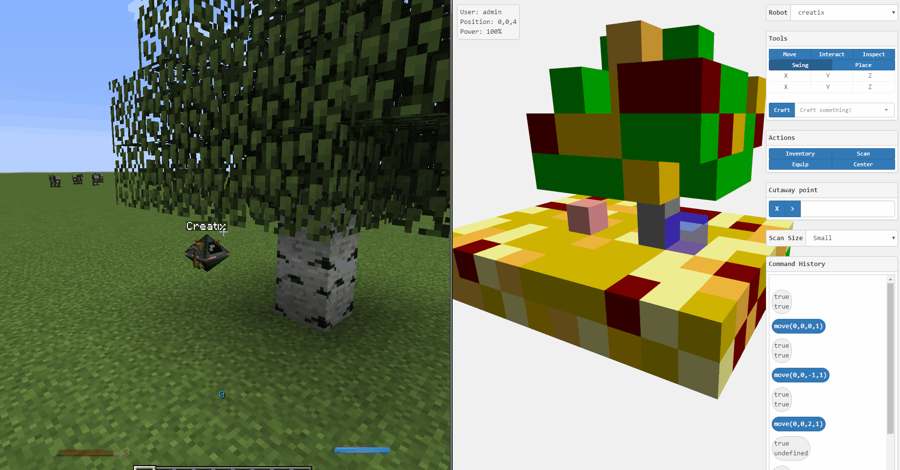

# Roboserver

This project lets you control [OpenComputers](http://ocdoc.cil.li/) robots through a simple GUI. No Lua coding necessary!



## Getting Started

(Tested on Minecraft version 1.10.2, OpenComputers version 1.6. If something's broken for your version, see [Reporting Bugs](#reporting-bugs)).

There are two ways to run the Roboserver: as a [standalone application](#standalone), or as a [server](#server). If you're not sure which is right for you, read the standalone section.

### Standalone

You can download Roboserver for Windows, OS X, or Linux [here](). Unpack and run it when the download finishes. You'll also need to remove "127.0.0.0/8" from the blacklist in your OpenComputers configuration file, otherwise your robot will be unable to connect.

Congratulations, you're halfway done! Next check out the [Robot](#robot) section.

### Server

Unless you run your own Minecraft server and want to let your players access the Roboserver from a web browser, you should read the [Standalone](#standalone) section instead.

1. Install Node.js and npm.
2. Clone this repository.
3. Run ```npm install``` in the project directory.
4. Rename ```public/js/config.example.js``` to ```public/js/config.js``` and optionally change the settings inside.
5. Run ```npm run server``` in the project directory.

If you're running the Roboserver on the same network as any robots trying to connect to it, you may need to change the blacklist settings in your OpenComputers configuration file.

Congratulations, you're halfway done! Next check out the [Robot](#robot) section.

### Robot

You need a robot with at minimum the following parts:
* [Gold Case](http://crafting-guide.com/browse/opencomputers/computer_case_tier_2/)
* [EEPROM (Lua BIOS)](http://crafting-guide.com/browse/opencomputers/eeprom_lua_bios/)
* [T2 CPU](http://crafting-guide.com/browse/opencomputers/central_processing_unit_cpu_tier_2/)
* [T1 Memory](http://crafting-guide.com/browse/opencomputers/memory_tier_1/) x2
* [T1 Hard Disk Drive](http://crafting-guide.com/browse/opencomputers/hard_disk_drive_tier_1/) with [OpenOS](http://crafting-guide.com/browse/opencomputers/floppy_disk_openos/) installed
* [Internet Card](http://crafting-guide.com/browse/opencomputers/internet_card/)
* [Geolyzer](http://crafting-guide.com/browse/opencomputers/geolyzer/)
* [Inventory Upgrade](http://crafting-guide.com/browse/opencomputers/inventory_upgrade/)
* [Inventory Controller Upgrade](http://crafting-guide.com/browse/opencomputers/inventory_controller_upgrade/)
* [Crafting Upgrade](http://crafting-guide.com/browse/opencomputers/crafting_upgrade/)

(If you decide to use Creatix, you'll have to give it a Geolyzer.)

Once your robot is running and OpenOS is installed, just run this command:

```
pastebin stillneedtodothis
```

After answering a few questions about your robot, it will connect to the server you started in the previous step. Congratulations, you're done! Next check out [these tips](tips.md) on how to use the Roboserver.

## Reporting Bugs

Before creating an issue, please read the [usage tips](tips.md), and check that it hasn't already been reported.

When reporting a bug in the [issue tracker](https://github.com/dunstad/roboserver/issues?q=is%3Aopen), in order to help me address your issue as quickly as possible, please provide the following information:

1. What version you're using of Minecraft and OpenComputers.
1. Steps to reproduce the problem
2. The expected behavior
3. The actual behavior

If you have them, screenshots, video, or error messages are always welcome.

Feel free to create a pull request if you've resolved an outstanding issue.

## License

This project is licensed under the MIT License - see the [LICENSE](LICENSE) file for details.

## Acknowledgments

This project is made possible by the continued effort of all the wonderful people who contribute to [OpenComputers](https://github.com/MightyPirates/OpenComputers).